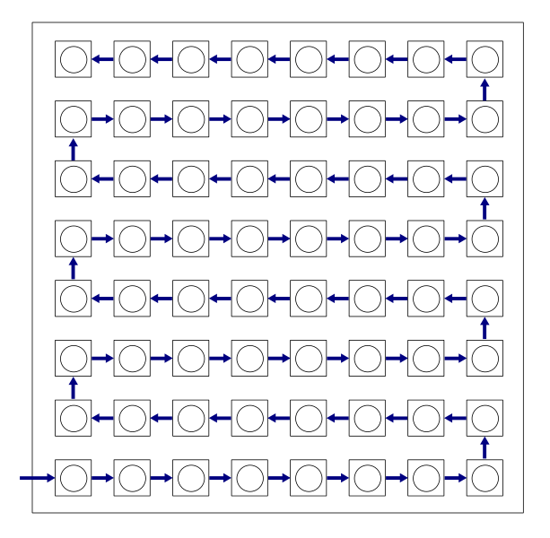
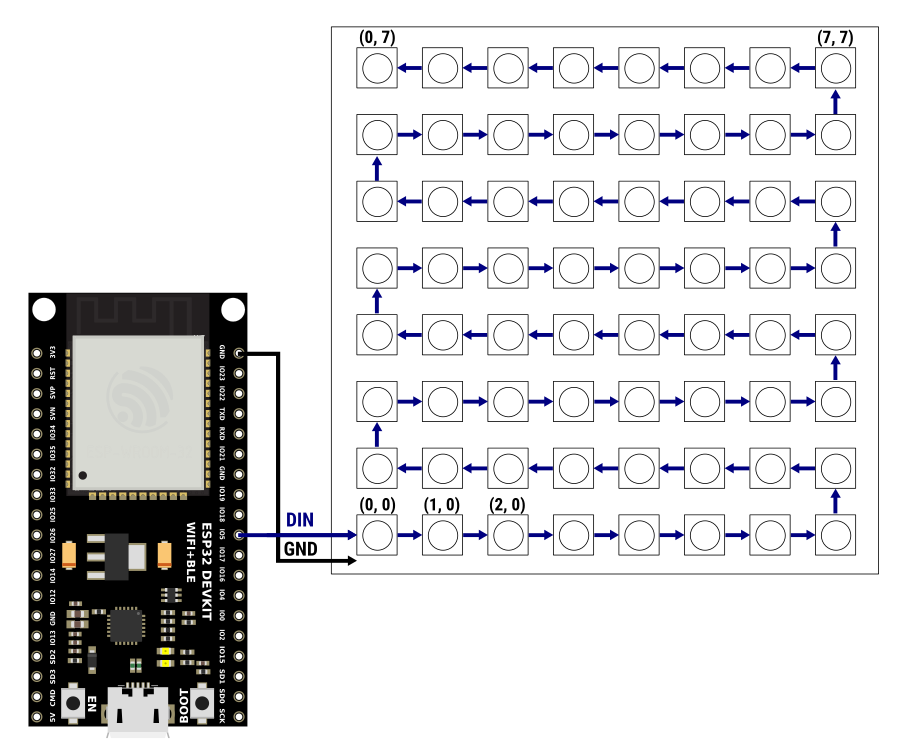
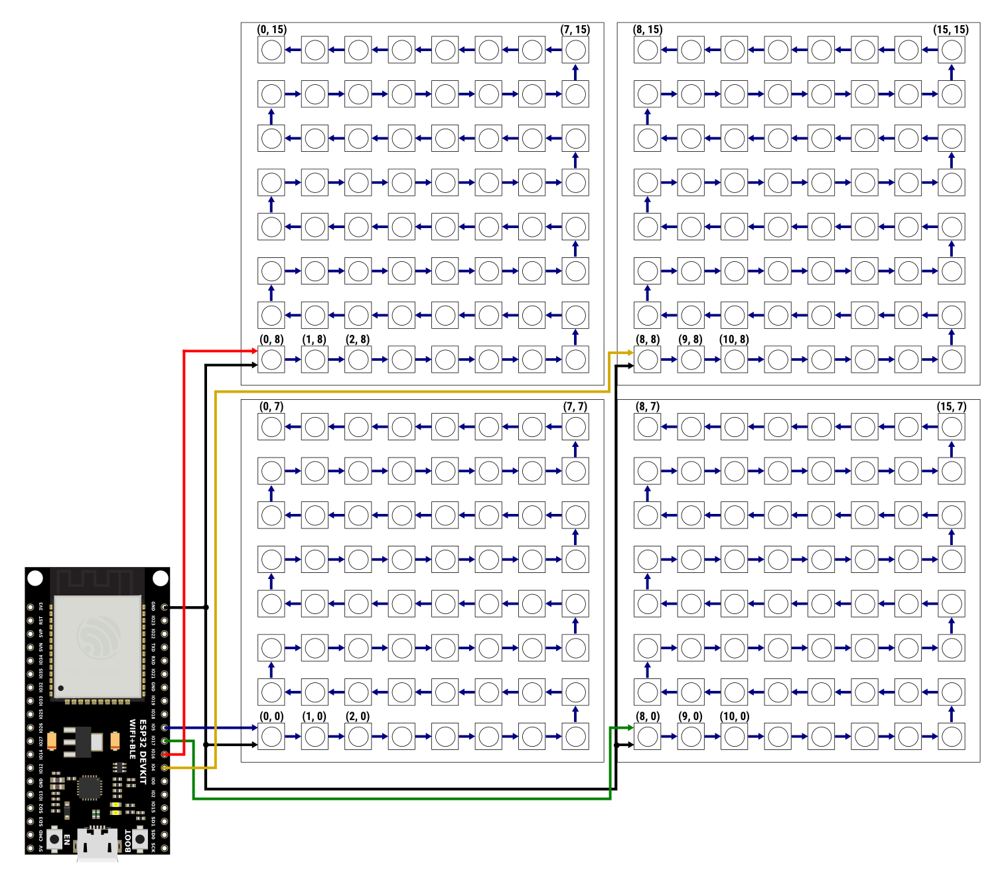
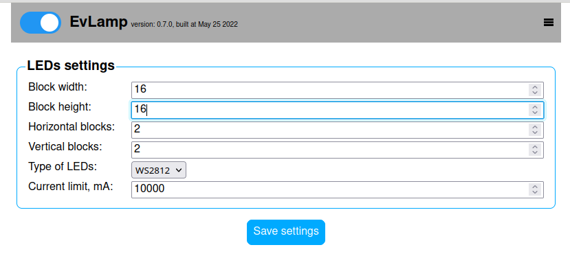

# EvLamp

"Clean" implementation of Alex Guyver's FireLamp analogue in pure C for ESP32.

## What it does

Display beautiful effects on a multiple matrices of NxN WS2812B/SK6812/APA106 LEDs.

### Features

- ~30 very beautiful effects from different authors, each with set of parameters
- WiFi connectivity in station or access point modes (support for DHCP/static IP addressing)
- [JSON HTTP API for remote controlling](API.md)
- Embedded webserver for remote controlling from browser
- *TODO: OTA*

## Hardware

You will need:

- ESP32 (ESP32 only! ESP32-S2/ESP32-C3/ESP32-C4 and others are not yet supported)
- One or more WS2812B/SK6812/APA106 LED matrices
- 4 buttons:
	- Main: long press - On/Off, click - next effect
	- Up/Down: brightness up/down
	- Reset: long press - Reset settings to defaults

### LED matrix

The LEDs in the matrix are connected in series like a "snake", starting from the bottom row:

The sizes of the most common matrices:
- 8x8
- 8x32
- 16x16

### Single matrix configuration

To control one matrix, only one GPIO pin of the microcontroller is needed:

This configuration is the simplest supported. The dimensions of the matrix side are limited to the range 8..128.

### Multiple LED matrices (blocks) configuration

You can connect up to 8 LED matrices of the same size to different GPIO pins and achieve high resolution
rendering of the effect. For example:

### Changing LED layout

Configure your LED layout at runtime by API or in browser ("Menu -> LEDs Settings"):

## Changing default settings 

You can select GPIOs, set default WiFi config, LED layout and more in `idf.py menuconfig`
(`*** EvLamp configuration ***`). 

## How to build firmware

- Setup latest ESP-IDF master
- `git clone https://github.com/UncleRus/EvLamp.git`
- `git submodule init --recursive --remote`
- `idf.py menuconfig`
- `idf.py build`
- `idf.py flash` to upload firmware to ESP
